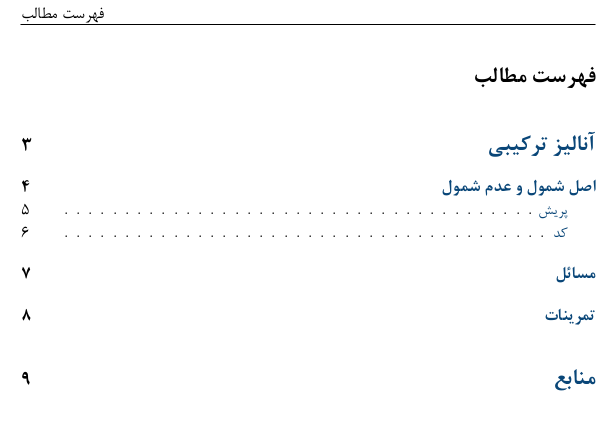
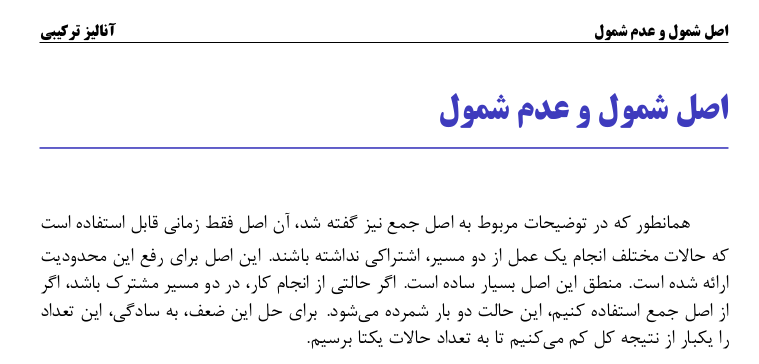
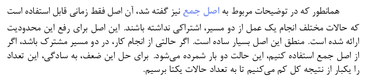
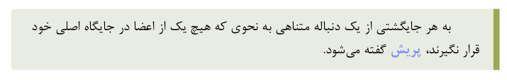
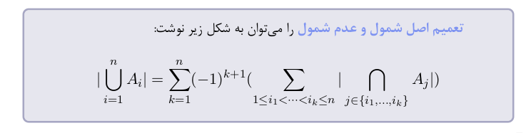
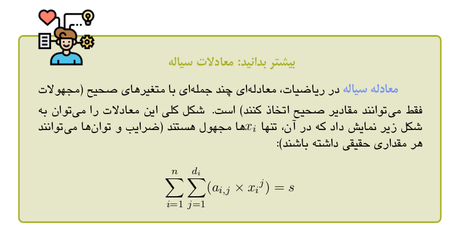
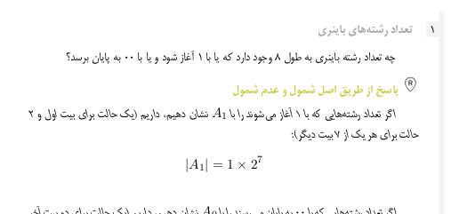
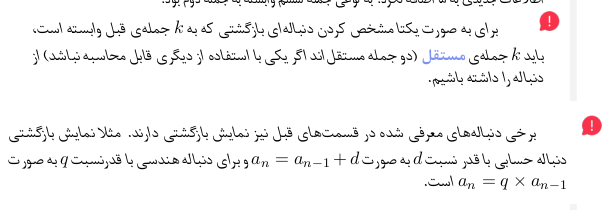
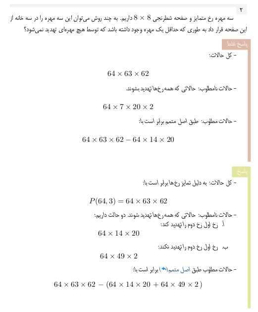
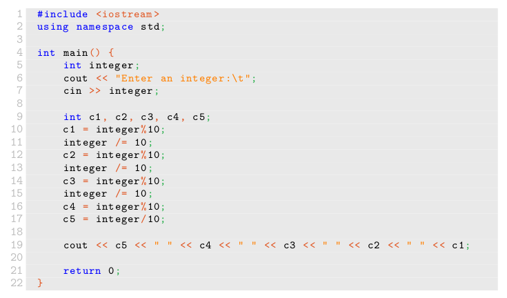

# <p align="right" >قالب فارسی زبان کتاب</p>

<p align="right">
&#x202b;
این قالب تحت
`Xelatex 2020`
آماده شده است اما
`Xelatex 2019`
نیز به خوبی با آن هماهنگ است.
دستورات آماده شده در این قالب به همراه نحوه استفاده، نمونه‌ی استفاده و خروجی متناظر
در زیر فهرست شده‌اند:
</p>

---
---
<!-- -------------------------------------------------------------------------------------------------- -->


<code style="margin-right:3%;">
\COVER[image path]
</code>

<br/>

<p align="right" style="margin-right:21%;">
&#x202b;
با استفاده از این دستور، می‌توانید یک صفحه پوشانده شده با تصویر
(با هدف تصویر جلد کتاب)
ایجاد کنید. لازم است آدرس مربوط به تصویر موردنظر را به آن ورودی دهید.
</p>

```latex
\COVER[./cover.jpg]
```
<br/><br/><br/><br/><br/>

---
<!-- -------------------------------------------------------------------------------------------------- -->


<code style="margin-left:3%;">
\p
</code>

<br/>

<p align="right" style="margin-left:21%;">
&#x202b;
این دستور یک پاراگراف جدید ایجاد می‌کند.
عوامل متأثر، تورفتگی ابتدای پاراگراف و فاصله‌ی زیادتر از خط قبلی است.
</p>

```latex
\p
دنباله‌ی
$X = \{x_1, x_2, x_3, \cdots, x_n\}$
را داریم. طولانی‌ترین زیردنباله‌ی صعودی
آن را به روش‌های زیر می‌توان به‌دست آورد:

\p
\textbf{روش کورکورانه:} 
تمام زیردنباله‌های
...

\p
...
```

---
<!-- -------------------------------------------------------------------------------------------------- -->



<code style="margin-right:3%;">
\TOC
</code>

<br/>

<p align="right" style="margin-right:21%;">
&#x202b;
این دستور، به صورت خودکار، بر اساس مطالب آورده شده در کتاب،
صفحات فهرست را ایجاد می‌کند. برای اجرا شدن درست این دستور،
نیاز به دو بار کامپایل کردن محتوا است.
</p>

```latex
\TOC
```
<br/><br/><br/><br/><br/>

---
<!-- -------------------------------------------------------------------------------------------------- -->


<code style="margin-left:3%;">
\CHAPTER[image path]{chapter name}{introduction paragraph}{paragrapher}
</code>

<br/>

<p align="right" style="margin-left:21%;">
&#x202b;
این دستور، صفحه‌ی آغاز فصل را ایجاد می‌کند.
نحوه عملکرد این دستور را می‌بینید. شمارنده فصل‌ها به صورت خودکار افزایش می‌یابد.
نامی که در این دستور برای فصل انتخاب می‌کنید، در سربرگ صفحات این فصل
(تا قبل از رسیدن به صفحه اول فصل بعدی)،
ظاهر خواهد شد.
همچنین، این دستور باعث ثبت نام فصل در فهرست می‌شود.
ورودی سوم این دستور، توضیحات فصل می‌باشد که شامل یک بند مقدمه است.
</p>

```latex
\CHAPTER[./combinations.jpg]{آنالیز ترکیبی}{
آنچه در این فصل مورد بحث قرار خواهد گرفت، مبحث شمارش است که به محاسبه‌ی تعداد حالات رخداد یک پدیده، بدون بررسی تک تک حالات می‌پردازد.
از کاربردهای این فصل می‌توان به محاسبه‌ی احتمالات پیش‌آمد‌ها، تخمین زمان اجرا و منابع مصرفی برنامه‌ها، برخی از تحلیل‌ها در گراف و ... اشاره کرد.
}{
    بی‌نام ناشناس
}
```

---
<!-- -------------------------------------------------------------------------------------------------- -->



<code style="margin-right:3%;">
\SECTION{section name}
</code>

<br/>

<p align="right" style="margin-right:21%;">
&#x202b;
این دستور، یک بخش جدید ایجاد می‌کند. نام بخش که در این دستور آورده می‌شود،
در فهرست مطالب و سربرگ صفحات آن بخش (قبل از رسیدن به آغاز بخش بعدی)
ثبت خواهد شد.
</p>

```latex
\SECTION{اصل شمول و عدم شمول}
```

---
<!-- -------------------------------------------------------------------------------------------------- -->


<code style="margin-left:3%;">
\SUBSECTION{subsection name}
</code>

<br/>

<p align="right" style="margin-left:21%;">
&#x202b;
این دستور، یک زیربخش جدید ایجاد و نام این زیربخش را در فهرست مطالب می‌کند.
</p>

```latex
\SUBSECTION{پریش}
```

---
<!-- -------------------------------------------------------------------------------------------------- -->



<code style="margin-right:3%;">
\FOCUSEDON{word}
</code>

<br/>

<p align="right" style="margin-right:21%;">
&#x202b;
این دستور، یک لغت را به صورت خاصی از بقیه‌ی متن متمایز می‌کند.
</p>

```latex
همانطور که در توضیحات مربوط به
\FOCUSEDON{اصل جمع}
نیز گفته شد، آن اصل
فقط زمانی قابل استفاده است که حالات مختلف انجام یک عمل از دو مسیر،
اشتراکی نداشته باشند. این اصل برای رفع این محدودیت ارائه شده است.
منطق این اصل بسیار ساده است. اگر حالتی از انجام کار، در دو مسیر مشترک باشد،
اگر از اصل جمع استفاده کنیم، این حالت دو بار شمرده می‌شود. برای حل این ضعف،
به سادگی، این تعداد را یکبار از نتیجه کل کم می‌کنیم تا به تعداد حالات یکتا برسیم.
```

---
<!-- -------------------------------------------------------------------------------------------------- -->



<code style="margin-left:3%;">
\begin{DEFINISION} ... \end{DEFINISION}
</code>

<br/>

<p align="right" style="margin-left:21%;">
&#x202b;
این دستور یک جعبه تعریف می‌سازد.
</p>

```latex
\begin{DEFINITION}
    \p
    به هر جایگشتی از یک دنباله متناهی به نحوی که هیچ یک از اعضا در
    جایگاه اصلی خود قرار نگیرند،
    \FOCUSEDON{پریش}
    گفته می‌شود.
\end{DEFINITION}
```

---
<!-- -------------------------------------------------------------------------------------------------- -->



<code style="margin-right:3%;">
\begin{THEOREM} ... \end{THEOREM}
</code>

<br/>

<p align="right" style="margin-right:21%;">
&#x202b;
این دستور یک جعبه قضیه می‌سازد.
</p>

```latex
\begin{THEOREM}
\p
\FOCUSEDON{تعمیم اصل شمول و عدم شمول}
را می‌توان به شکل زیر نوشت:
$$|\bigcup\limits_{i=1}^n A_i| = \sum\limits_{k=1}^n (-1)^{k+1} (\sum\limits_{1 \leq i_1 < \dots < i_k \leq n} |\bigcap\limits_{j \in \{i_1,...,i_k\}} A_j|)$$
\end{THEOREM}
```

---
<!-- -------------------------------------------------------------------------------------------------- -->



<code style="margin-left:3%;">
\begin{EXTRA}[extra logo path]{extra name} ... \end{EXTRA}
</code>

<br/>

<p align="right" style="margin-left:21%;">
&#x202b;
این دستور، یک جعبه بیشتر بدانید می‌سازد.
برای این جعبه‌ها، یک لوگوی پیشفرض قرار داده شده است که می‌توانید
با وارد کردن آدرس لوگو جایگزین خود به عنوان ورودی (اختیاری) اول دستور،
آن را تغییر دهید.
</p>


```latex
\begin{EXTRA}{بیشتر بدانید: معادلات سیاله}
    \p
    \FOCUSEDON{معادله سیاله}
    در ریاضیات،
    معادله‌ای چند جمله‌ای با متغیرهای صحیح
    (مجهولات فقط می‌توانند مقادیر صحیح اتخاذ کنند)
    است. شکل کلی این معادلات را می‌توان به شکل زیر نمایش داد
    که در آن، تنها ‌$x_i$ها مجهول هستند
    (ضرایب و توان‌ها می‌توانند هر مقداری حقیقی داشته باشند): 
    $$\sum\limits_{i=1}^{n} \sum\limits_{j=1}^{d_i} ({a_{i,j}} \times {x_i}^{j}) = s$$
\end{EXTRA}
```

---
<!-- -------------------------------------------------------------------------------------------------- -->



<code style="margin-right:3%;">
\begin{PROBLEM}[problem name] ... \end{THEOREM}
</code>
<br/>
<code style="margin-right:3%;">
\SOLUTION[solution name] {solution body}
</code>

<br/>

<p align="right" style="margin-right:21%;">
&#x202b;
از این دستورات برای ایجاد مسائل بین درسنامه استفاده می‌شود.
دستور اول یک جعبه سوال ایجاد می‌کند. این دستور شمارنده‌ی مسائل را زیاد می‌کند.
اگر در این دستور، نام سوال را وارد نکنید، چیزی بجای آن نوشته نمی‌شود و جای آن خالی می‌ماند.
دستور دوم، یک عنوان پاسخ، با متن داده شده به عنوان نام پاسخ، ایجاد می‌کند.
اگر نام پاسخ به دستور داده نشود، بجای آن عبارت «پاسخ» درنظر گرفته خواهد شد.
همچنین بدنه‌ی داده شده به این دستور، به فرمت پاسخ (با فونتی متفاوت) در خواهد آمد.
توجه کنید که می‌توان درون یک مسئله، بیش از یک پاسخ قرار داد.
</p>

```latex
\begin{PROBLEM}[تعداد رشته‌های باینری]
    \p
    چه تعداد رشته باینری به طول ۸ وجود دارد که یا با ۱ آغاز شود و یا با ۰۰ به پایان برسد؟

    \SOLUTION[\REF{R} پاسخ از طریق اصل شمول و عدم شمول]{
        \p
        اگر تعداد رشته‌هایی که با ۱ آغاز می‌شوند را با
        $A_{1}$
        نشان دهیم، داریم (یک حالت برای بیت اول و ۲ حالت برای هر یک از ۷ بیت دیگر):
        $$|A_1| = 1 \times 2^7$$
        ...
    }
\end{PROBLEM}
```

---
<!-- -------------------------------------------------------------------------------------------------- -->



<code style="margin-left:3%;">
\NOTE[right-margin]{text}
</code>

<br/>

<p align="right" style="margin-left:21%;">
&#x202b;
با این دستور می‌توانید یک نکته ایجاد کنید. یک نکته دارای یک علامت خاص، سمت راست خود
(خارج از کادر متن)
است که جلب توجه می‌کند. توجه کنید که دستور نکته، خود یک پاراگراف جدید ایجاد می‌کند.
درصورت نیاز به پاراگراف‌های بیشتر، می‌توانید داخل آن از دستور ایجاد پاراگراف استفاده کنید.
</p>

<p align="right" style="margin-left:21%;">
&#x202b;
اگر از این دستور، درون دستورات دیگر استفاده کنید، ممکن است میزان عقب‌نشینی آن به سمت راست مطلوب شما نباشد.
می‌توانید با مقدار‌دهی ورودی اول آن (که مقدار پیشفرض دارد و در مثال بالا از آن استفاده نکردیم)، میزان این عقب‌نشینی
را تعیین کنید.
</p>

```latex
\begin{some box}
    \NOTE[-1cm]{
        برای به صورت یکتا مشخص کردن دنباله‌ای بازگشتی که به $k$ جمله‌ی قبل وابسته است، باید $k$ جمله‌ی
        \FOCUSEDON{مستقل} (دو جمله مستقل‌اند اگر یکی با استفاده از دیگری قابل محاسبه نباشد) از دنباله را داشته باشیم.
    }
\end{some box}

\NOTE{
    برخی دنباله‌های معرفی شده در قسمت‌های قبل نیز نمایش بازگشتی دارند. مثلا نمایش بازگشتی دنباله حسابی با قدر نسبت 
    $d$ به صورت $a_n=a_{n-1}+d$ و برای دنباله هندسی با قدرنسبت $q$ به صورت $a_n=q \times a_{n-1}$ است.
}
```

---
<!-- -------------------------------------------------------------------------------------------------- -->



<code style="margin-right:3%;">
\EPROBLEM{text}
</code>

<br/>

<p align="right" style="margin-right:21%;">
&#x202b;
این دستور، یک مسئله پایان‌فصل جدید ایجاد می‌کند. تاثیر آن، رسم یک خط افقی
و زیاد کردن شمارنده مسائل است.
</p>

<br/>

<code style="margin-left:3%;">
\ESOLUTION[solution name]{solution body ...}
</code>

<br/>

<p align="right" style="margin-left:21%;">
&#x202b;
با اجرای این دستور، یک جعبه پاسخ برای مسائل آخر فصل ساخته می‌شود.
این جعبه، درواقع یک نوار سبز‌رنگ سمت راست صفحه است.
در ابتدای این نوار، نام سوال که ورودی اختیاری دستور است نوشته می‌شود.
این نام به صورت پیشفرض، عبارت «پاسخ» است.
</p>

<br/>

<code style="margin-right:3%;">
\EWSOLUTION[solution name]{solution body ...}
</code>

<br/>

<p align="right" style="margin-right:21%;">
&#x202b;
این دستور کاملا مشابه دستور قبل (ESOLUTION) است
با این تفاوت که برای پاسخ‌های غلط آماده شده است؛
نوار سمت راست آن قرمزرنگ بوده و نام پیشفرض آن «پاسخ غلط» است.
</p>

```latex
\EPROBLEM{
    \p
    سه مهره رخ متمایز و صفحه شطرنجی
    $8\times8$
    داریم. به چند روش می‌توان این سه مهره را در سه خانه
    از این صفحه قرار داد به طوری که حداقل یک مهره
    وجود داشته باشد که توسط هیچ مهره‌ای تهدید نمی‌شود؟

    \EWSOLUTION{
        -  کل حالات:
    
            \[64\times63\times62\]
    
        -  حالات نامطلوب: حالاتی که همه رخ‌ها تهدید بشوند.
        
            \[64\times7\times20\times2\]
    
        -  حالات مطلوب: طبق اصل متمم برابر است با:
    
            \[64\times63\times62 - 64\times14\times20\]
    }

    \ESOLUTION{
        -  کل حالات: به دلیل تمایز رخ‌ها برابر است با:

            \[ P(64,3) = 64\times63\times62\]

        -  حالات نامطلوب: حالاتی که همه رخ‌ها تهدید شوند.
        دو حالت داریم:
        \begin{enumerate}
            \item
            رخ اول رخ دوم را تهدید کند:
            \[64\times14\times20\]

            \item
            رخ اول رخ دوم را تهدید نکند:
            \[64\times49\times2\]
            
        \end{enumerate}

        -  حالات مطلوب طبق 
        \CROSSREF[اصل متمم]{اصل شمول و عدم شمول}
        برابر است با:
            \[64\times63\times62\ - (64\times14\times20\ + 64\times49\times2\ )\]
    }
}
```

---
<!-- -------------------------------------------------------------------------------------------------- -->


<code style="margin-left:3%;">
\EXERCISE
</code>

<br/>

<p align="right" style="margin-left:21%;">
&#x202b;
این دستور تنها یک شماره برای تمرین‌ها ایجاد کرده و آن را افزایش می‌دهد.
</p>

```latex
\EXERCISE
بدنه‌ی سوال اول

\EXERCISE
بدنه‌ی سوال دوم

\EXERCISE
بدنه‌ی سوال سوم

...
```

---
<!-- -------------------------------------------------------------------------------------------------- -->


<code style="margin-right:3%;">
\SOURCE{logo-name}
</code>
<br/>
<code style="margin-right:3%;">
\SOURCELINE{logo-name}{definition}
</code>
<br/>
<code style="margin-right:3%;">
\LRTSOURCELINE{logo-name}{definition}
</code>

<br/>

<p align="right" style="margin-left:21%;">
&#x202b;
با این دستورات، یک منبع جدید تعریف می‌شود. دستور اول برای تعریف منبع کافیست.
دستور دوم برای ساخت فهرست منابع استفاده می‌شود. دستور سوم هم‌ارز دستور دوم برای منابع با زبان‌های 
چپ به راست است.
لازم است یک لوگو متناظر در
آدرس
\lr{Contents/References/Icons/logo-name.png}
قرار گیرد.
</p>

```latex
\LRTSOURCELINE{R}{
    Kenneth H. Rosen, Discrete Mathematics and Its Applications, 7th Edition (1969)
}
\LRTSOURCELINE{Liber_Abaci}{
    Leonardo of Pisa, Liber Abaci (1202)
}
\LRTSOURCELINE{Leonard_of_Pisa_and_the_New_Mathematics_of_the_Middle_Ages}{
    Joseph Gies and Frances Gies, Leonard of Pisa and the New Mathematics of the Middle Ages (1969)
}
```

---
<!-- -------------------------------------------------------------------------------------------------- -->


<code style="margin-left:3%;">
\REF{source-name}
</code>

<br/>

<p align="right" style="margin-left:21%;">
&#x202b;
با این دستور می‌توان به یک منبع (source) از پیش تعیین شده ارجاع داد.
source-name
همان logo-name
در source
مقصود است.
</p>

```latex
\begin{EXTRA}[./Leonardo.jpeg]{\REF{Leonard_of_Pisa_and_the_New_Mathematics_of_the_Middle_Ages} فیبوناچی }
```

---
<!-- -------------------------------------------------------------------------------------------------- -->

<code style="margin-right:3%;">
\TARGET[what we see]{key}
</code>

<br/>

<p align="right" style="margin-left:21%;">
&#x202b;
با استفاده از این دستور، یک مقصد برای ارجاع داخلی تعریف می‌شود. از 
key
برای آدرس دادن به نقطه ارجاع دهنده استفاده می‌شود. عمدتاً نیازی به پر کردن بخش نمایشی نیست.
</p>

```latex
\begin{DEFINITION}
    \TARGET{تابع مولد نمایی}
    \p
    \FOCUSEDON{تابع مولد نمایی}
    نسخه‌ای تغییر یافته از تابع مولد است که
    برای دنباله‌ی 
    $a_{n}$
    به صورت زیر تعریف می‌شود:
      $$G(x)= a_{0} + a_{1}(\frac{x}{1!}) + a_{2}(\frac{x^{2}}{2!}) + ... = \sum\limits_{n=0}^{+\infty} a_{n}(\frac{x^{n}}{n!})$$
\end{DEFINITION}
```

---
<!-- -------------------------------------------------------------------------------------------------- -->


<code style="margin-left:3%;">
\CROSSREF[what we see]{key}
</code>

<br/>

<p align="right" style="margin-left:21%;">
&#x202b;
با استفاده از این دستور، به یک Target ارجاع داخلی می‌دهیم.
اگر قسمت نمایشی مقدار دهی نشود، از key بجای آن استفاده می‌شود.
</p>

```latex
برای کمک گرفتن از توابع مولد در حل مسائل شمارشی که در آن‌ها ترتیب با اهمیت است،
ساده‌تر است اگر از \CROSSREF{تابع مولد نمایی} استفاده شود.
استفاده از این روش را با چند مثال نشان خواهیم داد.
```

---
<!-- -------------------------------------------------------------------------------------------------- -->


<code style="margin-right:3%;">
\begin{AFFILIATIONS} ... \end{AFFILIATIONS}
</code>
<br/>
<code style="margin-right:3%;">
\AFFILIATIONROW
</code>
<br/>
<code style="margin-right:3%;">
\AFFILIATIONURL{what we see}{actual url}
</code>

<br/>
<br/>

<p align="right" style="margin-right:21%;">
&#x202b;
با استفاده از دستورات بالا،
همکاران را به شیوه مرسوم فهرست می‌کنیم.
</p>

<br/>

```latex
\begin{AFFILIATIONS}
    \AFFILIATIONROW
    {عارف افضلی}{دانشجوی کارشناسی مهندسی کامپیوتر دانشگاه تهران}{\AFFILIATIONURL{arefafzali.github.io}{https://arefafzali.github.io}}
    {مهرناز شمس‌آبادی}{دانشجوی کارشناسی مهندسی کامپیوتر دانشگاه تهران}{\AFFILIATIONURL{Mshamsabadi78@ut.ac.ir}{mailto:Mshamsabadi78@ut.ac.ir}}
    {هادی صفری}{دانشجوی کارشناسی ارشد مهندسی نرم‌افزار دانشگاه تهران}{\AFFILIATIONURL{hadisafari.ir}{https://hadisafari.ir}}
    \\\AFFILIATIONROW
    {سودابه محمدهاشمی}{دانشجوی کارشناسی مهندسی کامپیوتر دانشگاه تهران}{\AFFILIATIONURL{soudabe.mhashemi@ut.ac.ir}{mailto:soudabe.mhashemi@ut.ac.ir}}
    {کیمیا محمدطاهری}{دانشجوی کارشناسی مهندسی کامپیوتر دانشگاه تهران}{\AFFILIATIONURL{k.m.taheri@ut.ac.ir}{mailto:k.m.taheri@ut.ac.ir}}
    {یارا کامکار}{دانشجوی کارشناسی مهندسی کامپیوتر دانشگاه تهران}{\AFFILIATIONURL{ykamkar@ut.ac.ir}{mailto:ykamkar@ut.ac.ir}}
\end{AFFILIATIONS}
```

---
<!-- -------------------------------------------------------------------------------------------------- -->



<code style="margin-left:3%;">
\CODE{path}
</code>

<br/>

<p align="right" style="margin-left:21%;">
&#x202b;
این دستور، یک کد برنامه نویسی را جایگذاری می‌کند.
</p>

```latex
\CODE{./simple.cpp}
```

---
<!-- -------------------------------------------------------------------------------------------------- -->